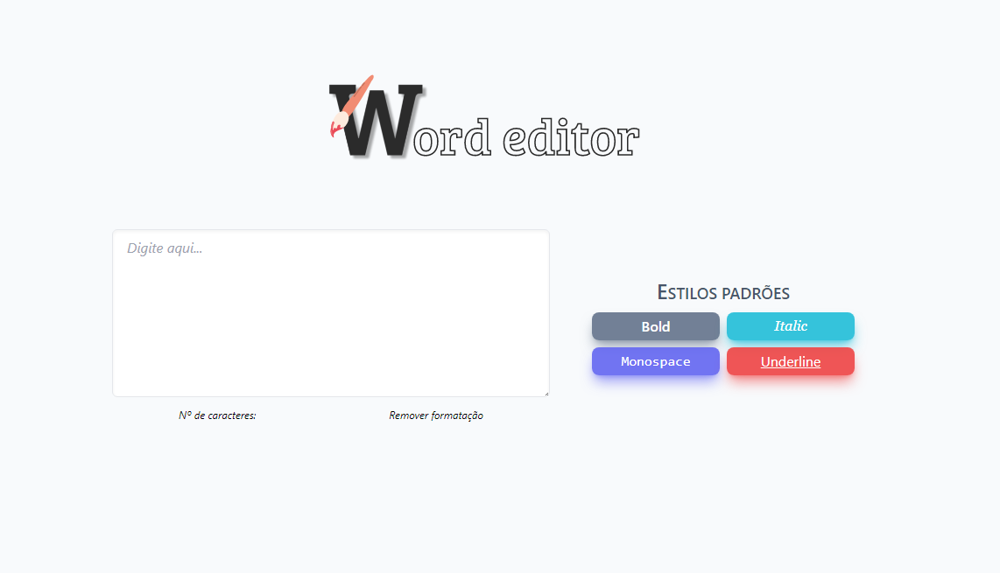

# Word Editor ✏

🚀 [Acesse o site aqui!](https://allbertuu.github.io/word-editor/) 🚀  

## 💬 Sobre o projeto
> Este projeto foi criado com o objetivo de colocar em prática os conhecimentos adquiridos em JavaScript ES6, CSS3 e o framework TailwindCSS.
> Utilizei conceitos avançados de flexbox, grid, responsividade e manipulação do DOM (Document Object Model).

## 💻 Tecnologias usadas
- JavaScript ES6
- HTML & CSS
- TailwindCSS

## 💡 Idealizado e feito por

<table>
  <tr>
    <td align="center">
      <a href="https://www.github.com/allbertuu">
         
        
          <b>Alberto Albuquerque</b>
        
      </a>
    </td>
  </tr>
</table>
